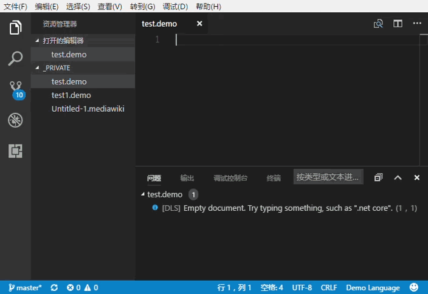

# LanguageServer.NET

[](https://www.nuget.org/packages/CXuesong.LanguageServer.VsCode) [](https://gitter.im/CXuesong/LanguageServer.NET?utm_source=badge&utm_medium=badge&utm_campaign=pr-badge)

A .NET server-side implementation of [Language Server Protocol](https://microsoft.github.io/language-server-protocol) infrastructure library for VSCode, and hopefully, might also be used with other IDEs that support Language Server Protocol. It supports LSP 2.0 and should support LSP 3.x (if not, please open an issue; thanks).



Based on [CXuesong/JsonRpc.Standard](https://github.com/CXuesong/JsonRpc.Standard), this .NET Standard library intends to provide basic interfaces and data structures so that you can write a language server in C#, build it on .NET Core and, with the help of the client-side code of [Microsoft/vscode-languageserver-node](https://github.com/Microsoft/vscode-languageserver-node), use it in VSCode.

For an actual (WIP) [Wikitext](https://en.wikipedia.org/wiki/Wiki_markup) language server based on this library, please take a look at [CXuesong/MwLanguageServer](https://github.com/CXuesong/MwLanguageServer).

The library is now available on NuGet. To install the package, run the following command 

```powershell
# Package Manager Console
Install-Package CXuesong.LanguageServer.VsCode -Pre
# dotnet CLI
dotnet add package CXuesong.LanguageServer.VsCode -Pre
```

## To set up the demo

### Prerequesites
* .NET Core SDK 3.1
* yarn (or npm)

### Steps

1.  Open `DemoLanguageServer` in VS, choose `Debug` profile, and build the project.
    * Alternatively, run `dotnet build` under `DemoLanguageServe` folder.
2.  Open `Client\VsCode` folder in VSCode.
3.  Run `yarn install` in the terminal.
4.  Press F5 and a new VSCode window (Extension Development Host) should show.
5.  Open a folder in the new VSCode window, and create a new file.
6.  Change the file language to `Demo Language`
7.  Then your editor will work as shown in the screenshot. Enter `.net core` in the editor and see what happens.

To debug the server application, you may wish to turn `WAIT_FOR_DEBUGGER` conditional switch on in `DemoLanguageServer/Program.cs`. After starting up the Extension Development Host, and activating the language server, you may attach VS Debugger to `dotnet` process and go on debugging.

You may also set the `default` value of `demoLanguageServer.trace.server` to `"messages"` in `package.json` to make language client show more debugging information.

## Notes

*   Though it's not mentioned in MS's official LSP documentation, by default VsCode uses stdin/stdout as JSON RPC transportation channel; thus it's important you SHOULD NOT read from/write to the console from your own code as long as the connection has been established, to avoid interfering the JSON RPC communication. 
*   If you are using the LSP client library from [`vscode-languageserver-node`](vscode-languageserver-node), other transportation channels, such as named pipe (Windows) or Unix domain socket (Linux/MacOS) is possible via client-side configuration; though you will need to write your own server-side implementation.
*   It's worthwhile to be noted that Unix domain socket has been introduced since Windows 10 Build 17063. However, there is currently no means to set up a Unix domain socket client in Node.JS on Windows. Thus it seems that, up till now, we still cannot use Unix domain socket as JSON RPC as transportation channel on Windows. See the tracking issue: [CXuesong/JsonRpc.Standard#4](https://github.com/CXuesong/JsonRpc.Standard/issues/4).